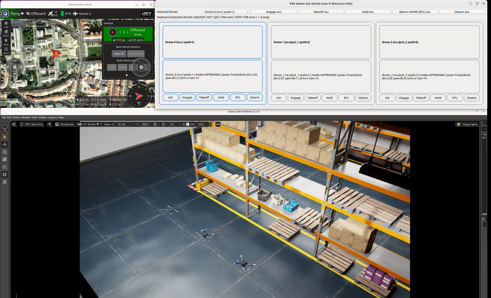
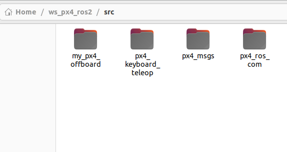

# Drone Swarm ROS 2 Workspace + NVIDIA Isaac Sim (Pegasus + PX4)

This repository contains a ROS 2 workspace for controlling **PX4-powered Iris drones inside NVIDIA Isaac Sim** using the **Pegasus Simulator** extension.

- `warehouse_drone` → single-drone workflow
- `warehouse_multi_px4` → multi-drone / swarm workflow (multiple PX4 instances)

> Tested setup (author’s working environment)
> - **NVIDIA Isaac Sim v5.1**
> - **NVIDIA driver 580.119.02** (verify with `nvidia-smi`)
> - Ubuntu 22.04 + ROS 2 Humble
>
> - 

---

## Repo layout

```
ws_px4_ros2/
  src/
    px4_msgs/              # PX4 message definitions
    px4_ros_com/           # PX4 <-> ROS 2 uXRCE-DDS bridge packages
    px4_keyboard_teleop/   # Optional teleop
    my_px4_offboard/       # Your offboard rclpy script(s)
```

**Pegasus / Isaac Sim launcher scripts**
- `warehouse_drone.py` (single drone)
- `warehouse_multi_px4.py` (N drones; swarm line spawn)

---

## Prerequisites

### 1) GPU / driver (critical for Pegasus + Isaac Sim)
Your known-good combination:

- **Isaac Sim:** v5.1
- **NVIDIA driver:** `580.119.02`

Verify:
```bash
nvidia-smi
```

### 2) NVIDIA Isaac Sim 5.1
Install Isaac Sim via Omniverse Launcher (or your preferred Isaac Sim install method).

Set a convenience variable (example path from your setup):
```bash
export ISAAC_SIM_INSTALL_ROOT="$HOME/.local/share/ov/pkg/isaac-sim-5.1.0"
```

(Optional) Add to `~/.bashrc`.

### 3) Pegasus Simulator (Isaac Sim extension)
Pegasus is an Isaac Sim framework/extension for PX4 multirotor simulation. See the official docs + repo for installation and usage.  
- Pegasus docs: https://pegasussimulator.github.io/PegasusSimulator/  
- Pegasus repo: https://github.com/PegasusSimulator/PegasusSimulator

> **Note (Isaac Sim 5.1 change):** Pegasus mentions a helper launcher `isaac_run` in newer docs. If you already use `python.sh` from Isaac Sim, that’s fine too.

### 4) PX4-Autopilot (required)
Clone PX4:
```bash
cd ~
git clone https://github.com/PX4/PX4-Autopilot.git
cd PX4-Autopilot
```

Build once (so autolaunch is fast):
```bash
make px4_sitl_default
```

You will later pass this path as `--px4_dir`.

### 5) ROS 2 Humble + build tools
Install ROS 2 Humble (Ubuntu 22.04). Also install build tools:
```bash
sudo apt update
sudo apt install -y   python3-colcon-common-extensions   python3-rosdep   git
```

Initialize rosdep (first time only):
```bash
sudo rosdep init || true
rosdep update
```

---

## Workspace setup (ROS 2)

The workspace is as follows : 
ws_px4_ros2 -> src -> Unzip the attached 'px4_keyboard_teleop' into a folder + Here install latest builds of px4_msgs and px4_ros_com

The src folder should look like this : 



git clone https://github.com/PX4/px4_msgs.git
git clone https://github.com/PX4/px4_ros_com.git

Unzip / place the workspace where you want it, then:

```bash
cd ws_px4_ros2
source /opt/ros/humble/setup.bash

# Install deps (best-effort)
rosdep install --from-paths src --ignore-src -r -y

# Build
colcon build --symlink-install

# Source
source install/setup.bash
```

---
## PX4 ↔ ROS 2 bridge notes (uXRCE-DDS)

PX4’s ROS 2 integration typically uses **uXRCE-DDS**:
- A **uXRCE-DDS client** runs on PX4.
- A **micro XRCE-DDS agent** runs on the companion computer (your machine).  
PX4 docs: https://docs.px4.io/main/en/middleware/uxrce_dds  
ROS 2 user guide: https://docs.px4.io/main/en/ros2/user_guide

If you don’t see `/fmu/*` topics, you usually need:
1) Agent on your machine (example):
```bash
MicroXRCEAgent udp4 -p 8888
```
2) Client started inside PX4:
```bash
uxrce_dds_client start -t udp -p 8888
```

> Exact transport/ports depend on your sim/bridge setup. Start from PX4 docs above and align with your PX4 SITL configuration.

---

## Run: Single/Swarm drone (warehouse_drone)

### Terminal 1 — Start Isaac Sim + Pegasus + PX4 autolaunch (I place these scripts inside PegasusSimulator/examples)
From your Isaac Sim directory:

```bash
cd "$ISAAC_SIM_INSTALL_ROOT"
./python.sh /ABS/PATH/warehouse_drone.py --px4_dir /home/$USER/PX4-Autopilot
```

```bash
cd "$ISAAC_SIM_INSTALL_ROOT"
 ~/isaacsim/python.sh /home/PegasusSimulator/examples/warehouse_multi_px4.py   --px4_dir /home/varun/PX4-Autopilot   --num_drones 3
```


### Terminal 2 — Start ROS 2 nodes (example offboard):

```bash
cd ws_px4_ros2
source /opt/ros/humble/setup.bash
source install/setup.bash

For controlling one drone
`ros2 run px4_keyboard_teleop gui`

For controlling 3 drones (change number for as many drones as you want, tested for 3 drones)
`ros2 run px4_keyboard_teleop gui_multi --num_drones 3 `

```

> If you later convert `my_px4_offboard` into a proper ROS 2 package (with `package.xml` + `setup.py`), you can use `ros2 run ...` instead.

---

## Run: Multi-drone / swarm (warehouse_multi_px4)

### Terminal 1 — Start Isaac Sim + Pegasus + N PX4 instances
```bash
cd "$ISAAC_SIM_INSTALL_ROOT"

./python.sh /ABS/PATH/warehouse_multi_px4.py   --px4_dir /home/$USER/PX4-Autopilot   --num_drones 5   --spacing 2.0   --start_x 4.0 --start_y 0.0 --start_z 0.07
```

Useful options:
- Place drones in a line along **Y** (default): `--line_axis y`
- Place drones in a line along **X**: `--line_axis x`
- Flip direction: `--line_dir -`
- Headless: `--headless`

---


## QGroundControl (recommended)

### Virtual / USB Joystick control
To fly manually in sim:
1. Open **QGroundControl**
2. Go to **Application Settings → Fly View**
3. **Enable Virtual Joystick**

---

## Known issues / fixes (from the working setup)

### A) Iris drone USD failing to load in Isaac Sim
If Pegasus expects `.../pegasus.simulator` but your extension folder is versioned, create a symlink:

```bash
ln -s   /home/varun/.local/share/ov/data/exts/v2/pegasus.simulator-5.1.0   /home/varun/.local/share/ov/data/exts/v2/pegasus.simulator
```

### B) NVIDIA driver / Isaac Sim version mismatch
Pegasus is sensitive to driver + Isaac Sim compatibility. The working combo for this repo is:

- **Isaac Sim 5.1**
- **Driver 580.119.02** (`nvidia-smi` to verify)

---

## Tips for swarm workflows

- Keep a clean mapping of **vehicle_id → namespace/topics** for multi-drone control.
- Start with **2 drones** and confirm:
  - All PX4 instances launch
  - QGC sees the vehicles
  - ROS topics appear for each instance
- Then scale up.

---

## Credits
- PX4 + PX4 ROS 2 bridge (`px4_ros_com`, `px4_msgs`)
- Pegasus Simulator (Isaac Sim extension)
- NVIDIA Isaac Sim
- https://github.com/artastier/PX4_Swarm_Controller
- https://github.com/ARK-Electronics/ROS2_PX4_Offboard_Example
